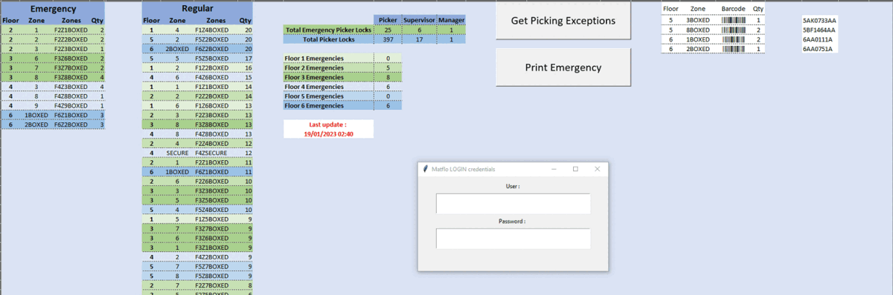

### Hi there 👋
\
My name is Sandor, I'm a self taught coding enthusiast.\
I'm currently working on automating some of my daily tasks with Pyhton / Selenium

During my journey I've built:
---
- Label Printer  ( MS Excel, VBA, MS Access )
\

---
- Tabel Scrapper ( MS Excel, Python, Selenium )
\

---
- Stock Investigtion Spreadsheet ( MS Excel, VBA )
 
  

<!--
**SanDPyth/SanDPyth** is a ✨ _special_ ✨ repository because its `README.md` (this file) appears on your GitHub profile.

Here are some ideas to get you started:

- 🔭 I’m currently working on ...
- 🌱 I’m currently learning ...
- 👯 I’m looking to collaborate on ...
- 🤔 I’m looking for help with ...
- 💬 Ask me about ...
- 📫 How to reach me: ...
- 😄 Pronouns: ...
- ⚡ Fun fact: ...
-->
